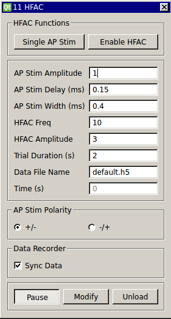

###High Frequency Conduction Block

**Requirements:** None  
**Limitations:** Generator class (included)  

This module implements a protocol for performing conduction block experiments on nerve fibers using high frequency AC current (HFAC) stimuli. Action potentials in the nerve are evoked with a single biphase square pulse and the HFAC signal is a sinusoidal waveform. You have an option to select which component of the biphase pulse occurs first. The “Single AP Stim” button is used to send a single pulse that can be used to elicit individual responses. The “Enable HFAC” toggle button can be used at any time to turn the HFAC signal on or off. The “Run” button starts a protocol in which the HFAC signal is enabled and the action potential stimulus is automatically triggered after a certain delay. Synchronizing this module with the Data Recorder will create separate trials in the HDF5 file corresponding to the protocols initiated with the “Run” button.

####Input Channels
None

####Output Channels
1. output(0) – “AP Stim” : action potential stimulus signal (biphasic square wave)
2. output(1) – “HFAC Signal” : sinusoidal high frequency AC signal 

####Parameters
1. AP Stim Amplitude : Amplitude of the action potential stimulus
2. AP Stim Delay (ms) : Delay after which to trigger the AP stimulus during a timed protocol
3. AP Stim Width (ms) : The width of each component of the biphasic AP stimulus
4. HFAC Freq (kHz) : Frequency of the HFAC signal
5. HFAC Amplitude : Amplitude of the HFAC signal
6. Trial Duration : the total duration of a single trial, the Data Recorder will keep recording for this duration when running a timed protocol
7. Data File Name : file name to use for the Data Recorder 
